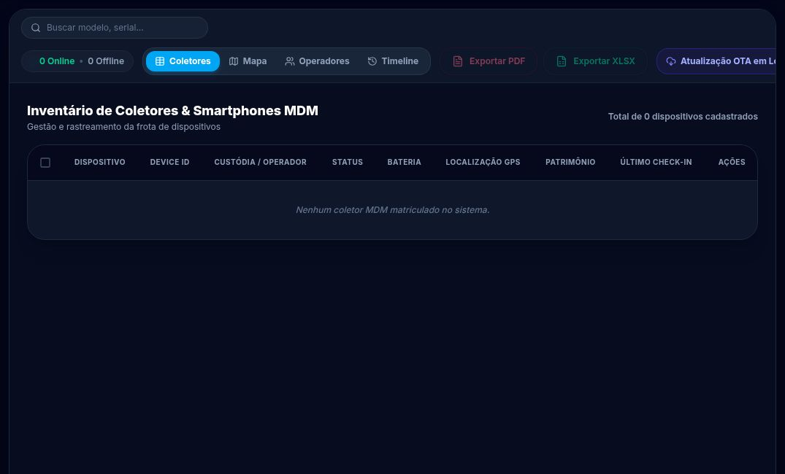
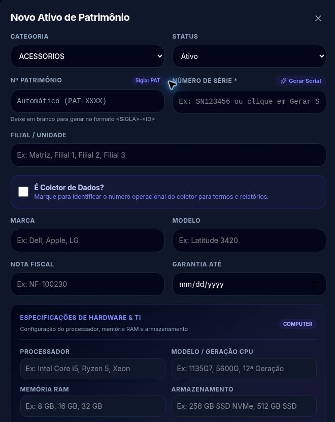
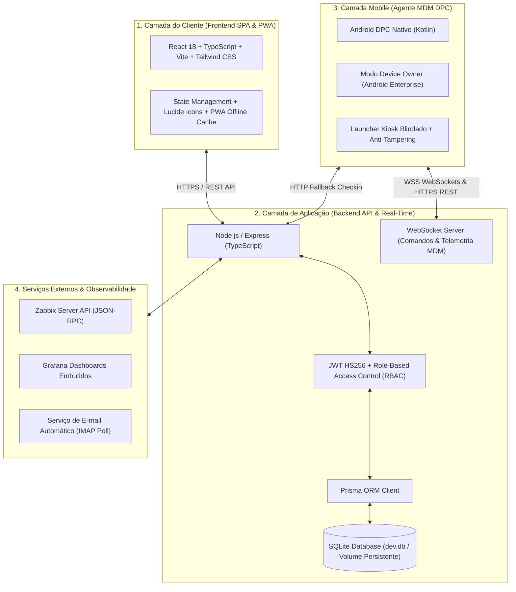

**Patrimônio, atendimento e dispositivos conectados à mesma operação.**

[Visão geral](#visão-geral) · [Módulos](#módulos) · [Galeria](#galeria) · [Arquitetura](#arquitetura-do-sistema) · [Tecnologia](#tecnologia) · [Documentação](#documentação-técnica-adicional) · [Contato](#contato)

## Visão geral

O **GIM — Gestão de Inventário e Mobilidade** reúne gestão patrimonial, suporte técnico, administração de dispositivos Android, monitoramento e rastreabilidade em uma plataforma web unificada.

Nasceu das necessidades práticas de uma operação corporativa de TI: saber quais equipamentos existem, quem está em custódia de cada ativo, o que precisa de atendimento técnico e como administrar os dispositivos móveis utilizados no dia a dia por operadores de logística e motoristas. O resultado é um ecossistema que conecta o trabalho do suporte à gestão dos equipamentos e da infraestrutura.

Este repositório apresenta o produto a empresas, parceiros e equipes técnicas. Contém documentação e imagens selecionadas; o código-fonte da aplicação é proprietário e permanece privado.

### O que muda na rotina

| Pergunta da operação | Como o GIM ajuda |
| --- | --- |
| Quais equipamentos temos e com quem estão? | Inventário com QR Code, responsáveis, setores, unidades e identificação patrimonial. |
| Como registrar entregas e transferências? | Movimentações com histórico cronológico e emissão de termos de responsabilidade em PDF. |
| O que o suporte precisa atender primeiro? | Chamados com categorias, prioridades, status e prazos de SLA regressivo. |
| Como administrar coletores e smartphones? | Painel MDM em tempo real, agente nativo Kotlin em modo Device Owner, launcher Kiosk blindado e comandos remotos via WebSocket. |
| Onde acompanhar a infraestrutura? | Integração com Zabbix API e painéis operacionais Grafana. |
| Como rastrear ações e proteger acessos? | Perfis de acesso (RBAC), auditoria forense (*Append-Only*) e cofre de credenciais com AES-256-GCM. |

---

## Galeria

> [!NOTE]
> **Privacidade & Conformidade com a LGPD:** Em total conformidade com a Lei Geral de Proteção de Dados (Lei nº 13.709/2018) e sigilo corporativo, todas as capturas públicas utilizam exclusivamente formulários vazios e listagens sem dados pessoais (CPFs, nomes de colaboradores, contatos, números de série reais ou coordenadas geográficas).

### Inventário de coletores e smartphones (Painel MDM)

  

### Cadastro patrimonial e abertura de chamados

<table>
  <tr>
    <td width="50%"></td>
    <td width="50%"></td>
  </tr>
  <tr>
    <td><b>Patrimônio:</b> identificação, unidade, nota fiscal, garantia e especificações técnicas.</td>
    <td><b>Service Desk:</b> categoria, SLA, solicitante, ativo relacionado, prioridade e descrição.</td>
  </tr>
</table>

---

## Módulos

### 01 · Patrimônio e inventário
Cadastro e consulta de computadores, notebooks, celulares, coletores, impressoras, periféricos e chips de telefonia.
- Identificação por patrimônio e número de série, com geração de identificador por categoria.
- Marca, modelo, unidade, responsável e situação operacional.
- Especificações completas de processador, memória RAM, armazenamento e sistema operacional.
- Vínculo com notas fiscais de compra e vigência de garantia.
- Consulta com filtros avançados, clonagem de ativos e identificação por QR Code.
- Exportações em PDF e XLSX.

### 02 · Movimentações e ciclo de vida
Histórico de entradas, transferências entre setores/unidades, empréstimos, devoluções, manutenção e baixas. A movimentação conecta o equipamento ao responsável e ao histórico operacional.

### 03 · Termos de responsabilidade
Emissão de documentos padronizados de cautela e entrega de equipamentos:
- Numeração sequencial única por exercício anual (`TR-AAAA-NNNN`).
- Controle de ciclo (emissão, pendente de assinatura e arquivamento).
- Geração instantânea em formato PDF pronto para impressão ou assinatura.
- Modelos para equipamentos em geral e termos dedicados para coletores móveis.

### 04 · Service Desk (ITSM) & SLA
Central de atendimento técnico:
- **Quadro Kanban:** organização em colunas (*Em Aberto*, *Em Atendimento*, *Pendente* e *Resolvido*).
- **SLA Dinâmico:** cálculo regressivo em minutos por categoria e alertas visuais de prazo.
- **Drawer Lateral:** detalhes e ações do chamado sem desmontar a visualização.
- **Timeline em Tempo Real:** mensagens e histórico com sincronização via WebSockets.
- **Portal de Autoatendimento:** abertura externa de tickets via QR Code patrimonial.

### 05 · MDM Android Proprietário (DPC) & Kiosk Blindado
Gerenciamento de coletores e smartphones corporativos via agente nativo em Kotlin com elevação a **Device Owner**:
- **Launcher Kiosk Blindado:** substitui a tela inicial nativa, restringindo aos apps autorizados e bloqueando configurações de sistema.
- **Provisionamento Zero-Touch (QR Code):** ativação em aparelhos novos ou restaurados via 6 toques na tela inicial do Android.
- **Comandos Remotos via WebSocket:** bloqueio com mensagem (`LOCK`), restauração de fábrica (`WIPE`), reinicialização (`REBOOT`) e sirene acústica com lanterna (`ALARM`).
- **Telemetria Contínua:** monitoramento de bateria, temperatura, memória e conectividade.
- **Anti-Tampering:** detecção ativa de Root, Frida, Xposed e depurador USB.
- **Sessão Administrativa de Campo:** liberação temporária das configurações locais com timeout automático.

### 06 · Observabilidade e NOC
Integração com Zabbix API para consulta de hosts, alertas e disponibilidade, além de área de dashboards do Grafana e **Modo TV** para telões de operação.

### 07 · Cofre de credenciais
Área restrita com criptografia autenticada **AES-256-GCM (AEAD)**, vetor de inicialização de 96 bits e tag de 128 bits, com registro compulsório no log de auditoria.

### 08 · Auditoria forense e controle de acesso (RBAC)
Perfis de acesso (Administrador, Técnico, Operador, Supervisor) e registro imutável (*Append-Only*) de eventos sensíveis com IP, User-Agent e timestamp.

### 09 · Relatórios executivos & console administrativo
Relatórios gerenciais de produtividade, TMA e imobilizados, com ferramentas administrativas seguras.

---

## Arquitetura do Sistema

O ecossistema é dividido em **4 camadas integradas**:

---

## Tecnologia

| Camada | Tecnologias Empregadas |
| --- | --- |
| **Interface Web** | React 18, TypeScript, Vite, Tailwind CSS e Lucide Icons. |
| **API & Real-time** | Node.js, Express, TypeScript e WebSockets nativos (`ws`). |
| **Persistência** | Prisma ORM e SQLite com driver `better-sqlite3`. |
| **Agente Android** | Kotlin e APIs oficiais Android Enterprise (`DevicePolicyManager`). |
| **Segurança** | Criptografia AES-256-GCM (AEAD), JWT (HS256) e hashing adaptativo com bcrypt. |
| **Observabilidade** | Zabbix API (JSON-RPC) e Grafana Dashboards. |
| **Infraestrutura** | Docker, Docker Compose e Portainer. |

---

## Documentação Técnica Adicional

Consulte os guias detalhados na pasta `docs/`:
- [🏗️ Arquitetura Detalhada do Sistema](docs/ARQUITETURA.md)
- [📱 Especificação Técnica do Agente MDM Android](docs/MDM_ANDROID.md)
- [⏱️ Roteiro de Demonstração Comercial (15 min)](docs/DEMONSTRACAO.md)
- [📋 Escopo e Limites da Apresentação Pública](docs/ESCOPO.md)

---

## Contato

**Matheus Felipe — Desenvolvimento & Arquitetura do GIM**

[Perfil no GitHub](https://github.com/oblivius321) · [LinkedIn](https://www.linkedin.com/in/matheus-felipe-silva-de-morais/)

Para agendar uma demonstração técnica com coletores homologados ou avaliar uma Prova de Conceito (PoC), entre em contato pelo perfil profissional.

---

<strong>GIM · Gestão de Inventário e Mobilidade</strong> 
As pessoas em movimento. A TI no controle.

