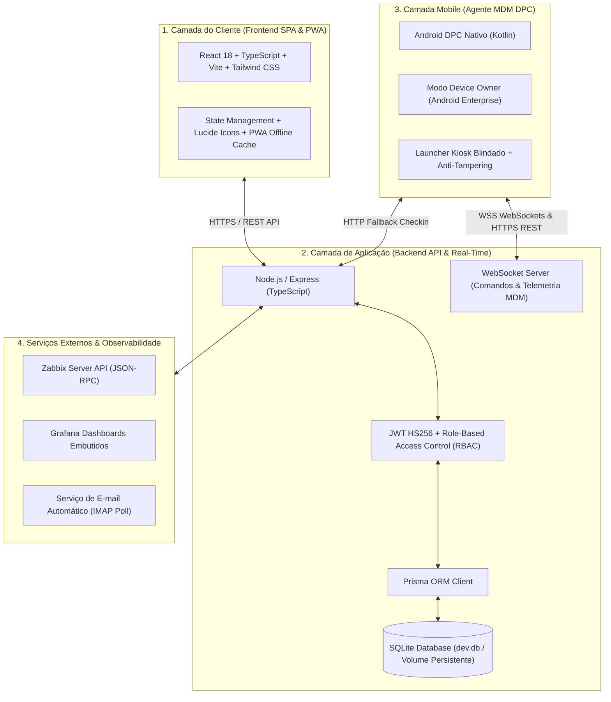
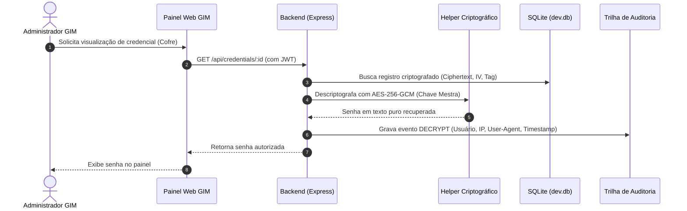

# 🏗️ Arquitetura do Sistema GIM

O **GIM (Gestão de Inventário e Mobilidade)** foi concebido sob uma arquitetura desacoplada, orientada a eventos e em tempo real, estruturada para atender operações de logística, chão de fábrica e escritórios corporativos com alta disponibilidade e baixa latência.

---

## 🏛️ Visão Geral em Camadas

---

## 1. Camada do Cliente (Web & PWA)
- **Framework:** React 18 com TypeScript, compilado com Vite para alta performance de carregamento.
- **Estilização:** Tailwind CSS com suporte a Dark Mode nativo e componentes responsivos com Glassmorphism.
- **PWA (Progressive Web App):** Service Worker configurado via `vite-plugin-pwa` para cache offline de ativos estáticos, instalabilidade no desktop e dispositivos móveis.
- **Visualização:** Recharts para indicadores de atendimento/NOC e Leaflet para renderização geoespacial (mapas de satélite dos coletores em campo).

---

## 2. Camada de Aplicação (Backend & WebSockets)
- **Runtime:** Node.js com Express e TypeScript.
- **Comunicação em Tempo Real:** Servidor WebSocket nativo (`ws`) integrado à porta HTTP principal, permitindo:
  - Envio instantâneo de comandos aos coletores Android conectados (`LOCK`, `WIPE`, `REBOOT`, `ALARM`, `NOTIFICATION`).
  - Sincronização em tempo real da timeline de chamados (`TICKET_SUBSCRIBE_AUTHENTICATED` e `TICKET_SUBSCRIBE_PUBLIC`).
- **Persistência & Dados:** Prisma ORM com driver otimizado `better-sqlite3`, permitindo execução em contêineres Docker com volumes mapeados no host para fácil backup e portabilidade.
- **Segurança da Sessão:** Tokens JWT com algoritmo estrito `HS256`, tempo de expiração controlado e verificação de integridade estrutural.

---

## 3. Camada Mobile (MDM DPC Proprietário)
- **Linguagem & Framework:** Kotlin nativo utilizando APIs de **Android Enterprise** (`DevicePolicyManager`).
- **Modo de Operação:** Provisionado como **Device Owner (DO)** exclusivo do sistema operacional Android.
- **Modo Kiosk Blindado:** O agente atua como *Home Launcher* padrão, impedindo que o operador acerte atalhos de sistema, barra de notificações ou instale apps não autorizados.
- **Defesa Ativa (Anti-Tampering):**
  - Detecção contínua de Root (verificação de binários `su` e diretórios protegidos);
  - Detecção de frameworks de injeção de código (*Frida* e *Xposed*);
  - Bloqueio de depuração USB (*ADB*) e opções de desenvolvedor em ambiente de produção.
- **Conectividade Resiliente:** Conexão permanente por WebSocket com mecanismo de reconexão exponencial e fallback HTTP para check-ins periódicos de telemetria (bateria, temperatura, memória e GPS).

---

## 4. Segurança Criptográfica & Governança

### Protocolos Implementados:
1. **Cofre de Credenciais:** Criptografia autenticada **AES-256-GCM (AEAD)** com vetor de inicialização (IV) de 96 bits exclusivo por registro e Authentication Tag de 128 bits para prevenção de ataques de manipulação de bits.
2. **Armazenamento de Senhas:** Hashing com `bcrypt` com fator de custo adaptativo e mitigação de *Timing Attacks*.
3. **Auditoria Forense Append-Only:** Toda modificação, comando MDM ou visualização de senha gera um registro imutável em `AuditLog` contendo identificador do usuário, IP de origem, User-Agent e timestamp.

---

## 5. Orquestração e Deploy
- **Ambiente de Produção:** Contêineres Docker orquestrados via Docker Compose / Portainer.
- **Persistência de Dados:** Volume Docker montado em diretório físico do host (`/app/data`), preservando a base de dados SQLite e snapshots de custódia.
