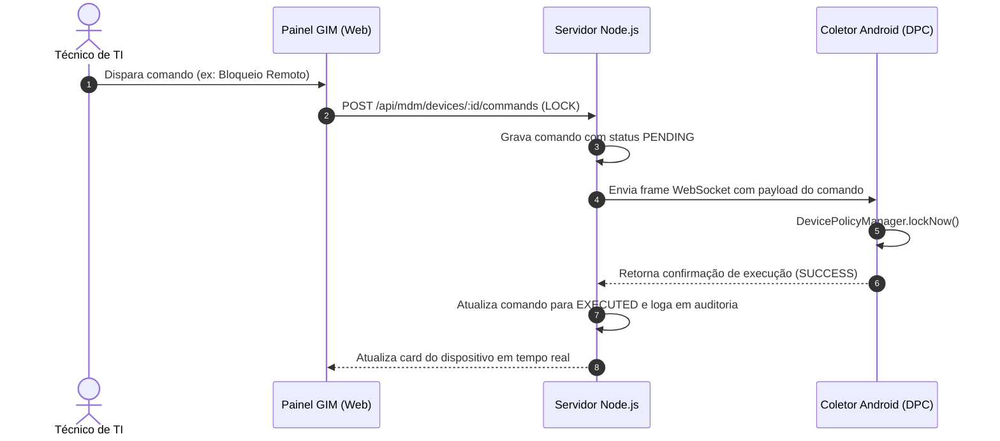

# 📱 Especificação Técnica — MDM Android Proprietário (DPC)

O módulo de Mobilidade do GIM conta com um aplicativo nativo desenvolvido em **Kotlin**, atuando como **Device Policy Controller (DPC)** através das APIs do framework oficial **Android Enterprise**.

---

## 🚀 Métodos de Provisionamento & Matrícula

O agente suporta dois métodos principais de matrícula corporativa:

### 1. Provisionamento Zero-Touch / QR Code (Produção)
Projetado para ativação rápida em aparelhos restaurados de fábrica (*Factory Reset*):
1. Na tela de boas-vindas inicial do Android (idioma), o técnico toca **6 vezes consecutivas** em um espaço em branco da tela.
2. O assistente de configuração ativa o leitor de QR Code corporativo embutido no sistema operacional.
3. O leitor escaneia o **QR Code de Provisionamento** gerado no painel web GIM contendo as seguintes propriedades:
   - `PROVISIONING_DEVICE_ADMIN_COMPONENT_NAME`: Declaração do componente `AdminReceiver`;
   - `PROVISIONING_DEVICE_ADMIN_PACKAGE_DOWNLOAD_LOCATION`: URL segura de download do APK do DPC;
   - `PROVISIONING_DEVICE_ADMIN_SIGNATURE_CHECKSUM`: Checksum SHA-256 do certificado de assinatura para garantir integridade;
   - `PROVISIONING_ADMIN_EXTRAS_BUNDLE`: Token dinâmico de matrícula e endereço da API do servidor.
4. O Android baixa o aplicativo automaticamente e o eleva a **Device Owner (DO)** sem intervenção do usuário.

### 2. Ativação via ADB (Homologação & Laboratório)
Para testes rápidos em dispositivos sem necessidade de formatação:
```bash
# 1. Instalação do pacote
adb install -r -d -g app-release.apk

# 2. Definição como Device Owner no nível de sistema
adb shell dpm set-device-owner com.empresa.gim.dpc/.receiver.AdminReceiver

# 3. Inicialização da tela de matrícula
adb shell am start -n com.empresa.gim.dpc/.ui.EnrollActivity
```

---

## 🔒 Modo Kiosk Blindado & Proteções do Sistema

Quando ativo, o aplicativo DPC substitui a tela inicial padrão do Android e assume o controle operacional:

| Recurso | Comportamento Implementado |
| :--- | :--- |
| **Home Launcher Exclusivo** | Bloqueia navegação por gestos/botão home, mantendo na tela apenas os aplicativos autorizados pela empresa. |
| **Barra de Notificações** | Oculta ou bloqueia expansão da barra de status, impedindo acesso às configurações de rede ou atalhos do sistema. |
| **Prevenção de Desinstalação** | Como Device Owner, o aplicativo é imune a desinstalação manual pelo usuário. |
| **Bloqueio de Reset de Fábrica** | Desativa a opção de restauração de fábrica manual pelas configurações do dispositivo. |
| **Sessão Administrativa de Campo** | Permite que técnicos de TI autorizados abram as configurações nativas do Android no próprio aparelho mediante autenticação com login do GIM, com encerramento automático por timeout de segurança. |

---

## 🛡️ Camada Anti-Tampering (Detecção Ativa de Violações)

O agente executa rotinas periódicas de integridade em segundo plano:
- **Detecção de Root:** Busca pela existência de binários `su`, `magisk` e montagens de partição `/system` com permissão de escrita.
- **Detecção de Hooks & Injeção:** Identifica a presença de processos e bibliotecas do **Frida** e **Xposed Framework**.
- **Depuração USB / Modo Desenvolvedor:** Monitora as configurações do sistema para garantir que a depuração USB permaneça inativa em aparelhos de produção.

---

## ⚡ Comandos Remotos em Tempo Real via WebSocket

O agente mantém um canal persistente e criptografado via WebSocket com o servidor GIM.



### Comandos Disponíveis:
- **`LOCK`**: Bloqueia a tela imediatamente exibindo mensagem customizada e telefone de contato do suporte de TI.
- **`WIPE`**: Restaura o aparelho para as configurações de fábrica (eliminação segura de dados corporativos em caso de perda ou furto).
- **`REBOOT`**: Reinicia o sistema operacional do coletor remotamente.
- **`ALARM / SIREN`**: Dispara alarme sonoro em volume máximo e aciona a lanterna traseira para facilitar a localização física em galpões logísticos.
- **`PUSH_NOTIFICATION`**: Exibe comunicado urgente na tela do operador.
- **`OTA_UPDATE`**: Executa o download silencioso e instalação de nova versão do APK corporativo.

---

## 📊 Telemetria Contínua de Frota

A cada intervalo configurável (e mediante eventos de alteração de estado), o agente transmite:
- Nível percentual de bateria, status de carregamento e temperatura térmica;
- Espaço total e livre de armazenamento interno e memória RAM;
- Coordenadas geográficas de GPS (quando disponível e com permissão) para plotagem em mapa de satélite;
- Conectividade de rede (SSID do Wi-Fi conectado, força de sinal dBm, IP local e gateway);
- Inventário de pacotes de aplicativos instalados e versões.
