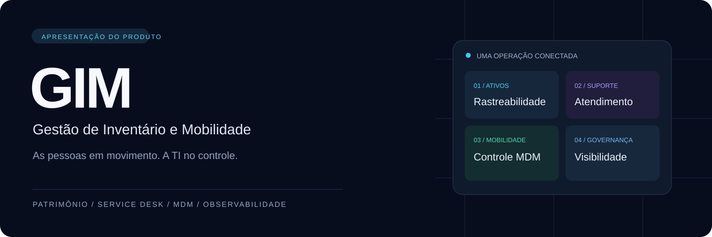
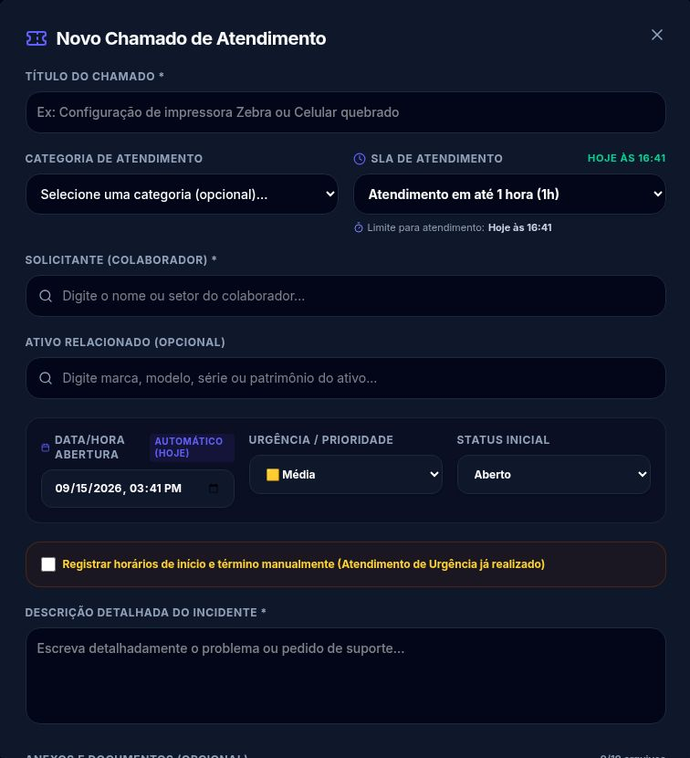
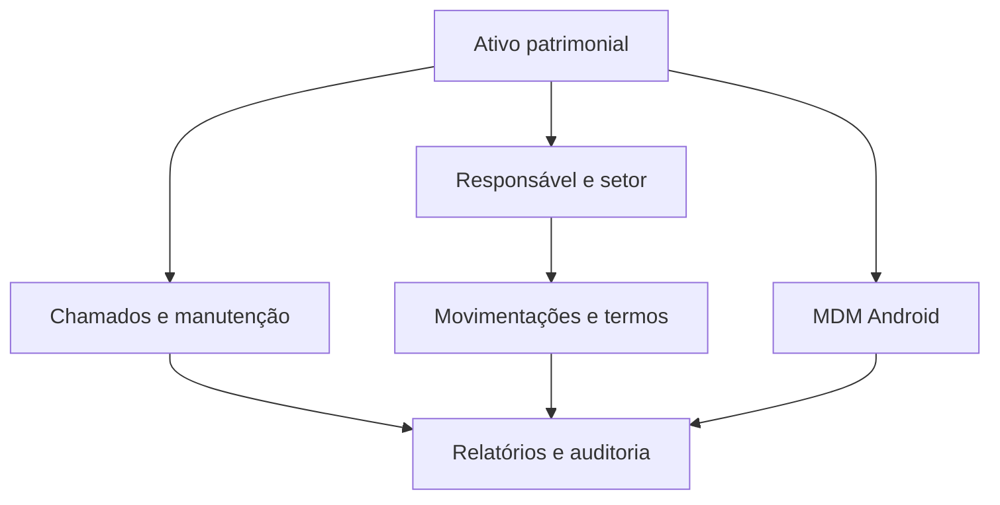

**Patrimônio, atendimento e dispositivos conectados à mesma operação.**

[Visão geral](#visão-geral) · [Módulos](#módulos) · [Galeria](#galeria) · [Tecnologia](#tecnologia) · [Contato](#contato)

## Visão geral

O **GIM — Gestão de Inventário e Mobilidade** reúne gestão patrimonial, suporte técnico, administração de dispositivos Android, monitoramento e rastreabilidade em uma plataforma web.

Nasceu das necessidades práticas de uma operação de TI: saber quais equipamentos existem, quem está com cada ativo, o que precisa de atendimento e como administrar os dispositivos usados no dia a dia. O resultado é um sistema que conecta o trabalho do suporte à gestão dos equipamentos e da infraestrutura.

Este repositório apresenta o produto a empresas, parceiros e equipes técnicas. Contém documentação e imagens selecionadas; o código-fonte da aplicação é proprietário e permanece privado.

### O que muda na rotina

| Pergunta da operação | Como o GIM ajuda |
| --- | --- |
| Quais equipamentos temos e com quem estão? | Inventário, responsáveis, setores, unidades e identificação patrimonial. |
| Como registrar entregas e transferências? | Movimentações, histórico e emissão de termos de responsabilidade. |
| O que o suporte precisa atender primeiro? | Chamados com categorias, prioridades, status e prazos de SLA. |
| Como administrar coletores e smartphones? | Painel MDM, agente Android, modo kiosk e comandos remotos. |
| Onde acompanhar a infraestrutura? | Integrações com Zabbix e painéis Grafana. |
| Como rastrear ações e proteger acessos? | Perfis de acesso, auditoria e cofre de credenciais. |

## Módulos

### 01 · Patrimônio e inventário

Cadastro e consulta de computadores, notebooks, celulares, coletores, impressoras, periféricos e outras categorias de ativos.

- Identificação por patrimônio e número de série, com geração de chave por categoria.
- Marca, modelo, unidade, responsável e situação operacional.
- Especificações de processador, memória, armazenamento e sistema operacional.
- Dados de nota fiscal e garantia.
- Consulta com filtros, duplicação de ativos e identificação por QR Code.
- Exportações em PDF e XLSX.

**Aplicação prática:** padronizar o cadastro de uma remessa de equipamentos e acompanhar sua alocação ao longo do uso.

### 02 · Movimentações e ciclo de vida

Histórico de entradas, transferências, empréstimos, devoluções, manutenção e baixas, conforme os fluxos disponíveis na aplicação. A movimentação conecta o equipamento ao responsável e à operação executada.

**Aplicação prática:** consultar a trajetória de um equipamento para entender sua situação atual e as mudanças de responsabilidade.

### 03 · Termos de responsabilidade

Emissão de documentos de entrega e responsabilidade, com identificação dos equipamentos e envolvidos. A documentação do produto prevê numeração, controle de versões e geração de PDF, incluindo termos dedicados a dispositivos móveis.

**Aplicação prática:** documentar a entrega de um coletor ou notebook e manter a referência vinculada ao processo patrimonial.

### 04 · Service Desk e SLA

Central de atendimento com abertura de chamados, vínculo com solicitante e ativo, categorias, urgência, prazos e histórico.

- Fluxo de aberto, em atendimento, pendente e resolvido.
- SLA por categoria e configuração de prazo no atendimento.
- Registro de horários de início e encerramento.
- Comentários, notas técnicas e anexos.
- Origem por painel web e integração de e-mail descrita na documentação.
- Relatórios de atendimento, tempo de resolução e cumprimento de SLA.

**Aplicação prática:** registrar um incidente de impressora, definir sua prioridade, acompanhar o atendimento e consultar o histórico técnico.

### 05 · MDM Android e modo kiosk

Gerenciamento de coletores e smartphones corporativos por um agente Android próprio em Kotlin, com administração via Device Owner.

| Área | Recursos apresentados pelo produto |
| --- | --- |
| Frota | Inventário de dispositivos, status online/offline e último check-in. |
| Operação | Custódia, operadores e timeline de eventos. |
| Telemetria | Bateria, armazenamento, informações do aparelho e dados de localização quando disponíveis. |
| Kiosk | Launcher corporativo e restrição aos aplicativos autorizados. |
| Comandos | Bloqueio, reinicialização, limpeza remota, mensagens e recursos de localização sonora descritos na documentação. |
| Distribuição | Matrícula de dispositivos e interface para atualização OTA em lote. |
| Administração | Liberação administrativa temporária e controles de proteção descritos para o agente. |

**Compatibilidade:** os recursos dependem da versão do Android, fabricante, permissões, provisionamento e conectividade. A homologação deve ser realizada nos modelos usados pela empresa. A presença de um mapa GPS não equivale a localização precisa dentro de armazéns.

**Aplicação prática:** restringir o coletor aos aplicativos de trabalho e acompanhar sua comunicação com o painel, conforme a configuração homologada.

### 06 · Observabilidade e NOC

Integração com a API do Zabbix para consultar hosts, alertas e disponibilidade, além de uma área de painéis Grafana. O dashboard reúne indicadores operacionais e oferece modo de exibição para TV.

**Aplicação prática:** acompanhar a infraestrutura e o atendimento a partir do mesmo ambiente de trabalho. As integrações exigem configuração dos respectivos serviços.

### 07 · Cofre de credenciais

Área restrita para organizar credenciais corporativas. A documentação técnica descreve criptografia AES-256-GCM, controle de visualização e registro de acesso a informações sensíveis.

**Aplicação prática:** centralizar acessos técnicos com controle de permissão e rastreabilidade, evitando sua dispersão em anotações e planilhas.

### 08 · Auditoria e controle de acesso

Perfis de acesso separam as áreas disponíveis a administradores, técnicos, operadores e supervisores. A auditoria registra eventos e ações relevantes para consulta posterior.

**Aplicação prática:** identificar a autoria de uma alteração ou de uma ação administrativa e limitar o acesso conforme a função de cada usuário.

### 09 · Relatórios e administração

Áreas de relatórios gerais, imobilizados e atendimento, além de cadastros de usuários e setores. A documentação também descreve ferramentas administrativas de consulta e manutenção do banco, com restrições para operações de escrita.

**Aplicação prática:** preparar análises do parque e do suporte, manter cadastros organizados e apoiar a administração técnica do ambiente.

## Galeria

Capturas reais da interface, realizadas em setembro de 2026. Foram selecionados formulários vazios e uma listagem sem dispositivos para preservar os dados internos. As imagens mostram a interface; não representam uma demonstração de execução de comandos ou indicadores de desempenho.

### Inventário de coletores e smartphones

### Cadastro patrimonial e abertura de chamados

<table>
  <tr>
    <td width="50%"></td>
    <td width="50%"></td>
  </tr>
  <tr>
    <td>Identificação, unidade, nota fiscal, garantia e especificações técnicas.</td>
    <td>Categoria, SLA, solicitante, ativo relacionado, prioridade e descrição.</td>
  </tr>
</table>

## Uma operação conectada

Um equipamento é cadastrado no patrimônio e associado a um responsável. Sua entrega pode ser documentada por um termo. Durante o uso, chamados e movimentações ajudam a registrar o que aconteceu com ele. Para dispositivos Android homologados, o MDM acrescenta administração e telemetria. Relatórios e auditoria permitem acompanhar esse conjunto ao longo do tempo.

## Tecnologia

Visão de alto nível, baseada na documentação do projeto.

| Camada | Tecnologias |
| --- | --- |
| Interface web | React, TypeScript, Vite e Tailwind CSS. |
| API | Node.js, Express e TypeScript. |
| Dados | Prisma ORM e SQLite na arquitetura documentada. |
| Comunicação | APIs REST e WebSockets. |
| Agente Android | Kotlin e APIs de administração Device Owner. |
| Monitoramento | Zabbix e Grafana. |
| Implantação | Docker, infraestrutura de servidor e gerenciamento de contêineres. |

O modelo de implantação, dimensionamento, suporte e escopo comercial deve ser definido conforme a empresa. Este material não anuncia planos, preços, certificações ou garantias de escala.

## Demonstração e avaliação

O GIM pode ser apresentado a equipes de TI, operações que utilizam coletores e smartphones e parceiros interessados em conhecer a solução. Uma avaliação deve partir dos fluxos da empresa e dos dispositivos que serão utilizados.

Veja o [roteiro de demonstração](docs/DEMONSTRACAO.md) e o [escopo desta apresentação](docs/ESCOPO.md).

## Contato

**Matheus Felipe — desenvolvimento do GIM**

[Perfil no GitHub](https://github.com/oblivius321) · [LinkedIn](https://www.linkedin.com/in/matheus-felipe-silva-de-morais/)

Para conhecer os módulos e discutir uma demonstração, entre em contato pelo perfil profissional.

---

<strong>GIM · Gestão de Inventário e Mobilidade</strong> 
As pessoas em movimento. A TI no controle.

